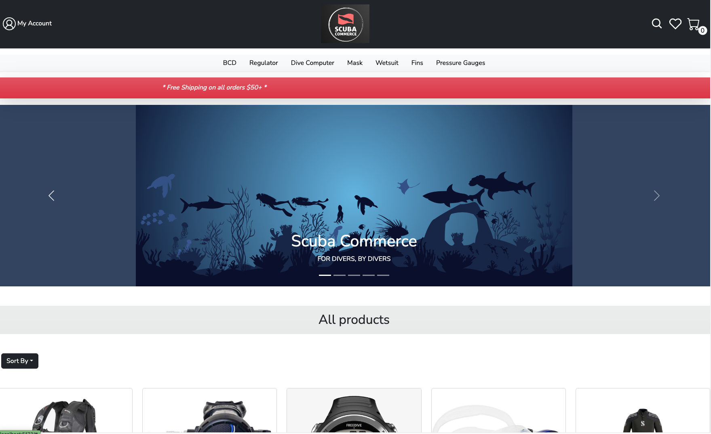

# Scuba Commerce 🤿

Welcome to the Scuba Commerce repository! This project offers an e-commerce platform specialized for scuba diving equipment.

[Live Site](https://scuba-commerce-ef8c050498e9.herokuapp.com/)



## Features
- User Authentication 
Secure registration with condition on password, controlling username and email duplication using user database and login functionalities
-  Product Display 
A wide range of diving equipment, divided into 7 product category with product detail information on single page. You can also sort by price, browse and filter products by brand and category.
- Cart System
 Add products to cart, edit cart ,remove item in cart. Cart will be seperated to guest cart and user cart or logged-in user controlling by cart database. Cart for each users will be persistent even when close the browser/ refresh page or log out and log back in.
-  Wishlist 
Save products to view and purchase later for both guest and logged-in user
- Product Reviews 
Read product reviews from other divers or write your own but each product only allow 1 review from user or guest.
- Order History 
Logged-in user will be able to see their order history after purchase.
- Profile Update 
Logged-in user will be able to update their personal information, password and shipping address.

## Tech Stack
This project is built using the following technologies:

### Backend:
- Node.js
- Express.js (v4.18.2)
- PostgreSQL (pg v8.11.3)
- Express session
- Cookie parser and signature
- Bcrypt
- JWT decode and JSON web token

### Frontend:
- Vite and React.js (v18.2.0) : For building UI components.
- React Router : For handling route and navigation.
- React-Icons (v6.2.0)
- Bootstrap and React Bootstrap : For responsive styling and layout.
- Regex: for password condition.

## Future Improvement:
- Payment integration with stripe API
- Inventory control controlling inventory after purchasing through database
- Guest to logged in user cart remains the same
- Create admin role for specific permission


## Getting Started: 
#### 1. Clone the repository:
```bash
  git clone [your-repository-url]
```

#### 2. Navigate into the project directory:
```bash
  cd [your-repository-name]
```

#### 3. Install the required dependencies:
```bash
  npm install
```

#### 4. Start the development server:
```bash
  npm run dev
```

## Deployment Instructions: 
#### 1. Build the application for production:
```bash
  npm run build
```

#### 2. To start the server:
```bash
  npm start
```

#### 3. Deploying to heroku: 
After create a new Heroku application, make sure you have the Heroku CLI installed and you're logged in. 
```bash
  git push heroku main
```

After pushing, Heroku will automatically detect a Node.js app and start building your app. The heroku-postbuild script ensures the app is built on Heroku post the push.
Once the build is done, you can open your app with:
```bash
  heroku open
```

### For Local Development: 

### In src > api > index.js
- Change BASE_URL for local development 

### In index.js
- Change cors origins to localhost 
- Uncomment 
```bash
# app.use(session({
#      secret: 'secret-key',
#      resave: false,
#      saveUninitialized: true,     // ** use True for both local and dev
#      cookie: {
#          secure: true, //false for local **
#          maxAge: 7 * 24 * 60 * 60 * 1000,
#          sameSite: 'lax', //for deploy
#          httpOnly: true,
#      }, // Set secure to true later for deploy using https. For local development, use false. **
#      genid: (req) => {
#          return uuidv4(); // Use UUIDs for session IDs
#      }
#  }));
```

## Authors

- [@tanggoma](https://github.com/Tanggoma/capstone_ecommerce)
